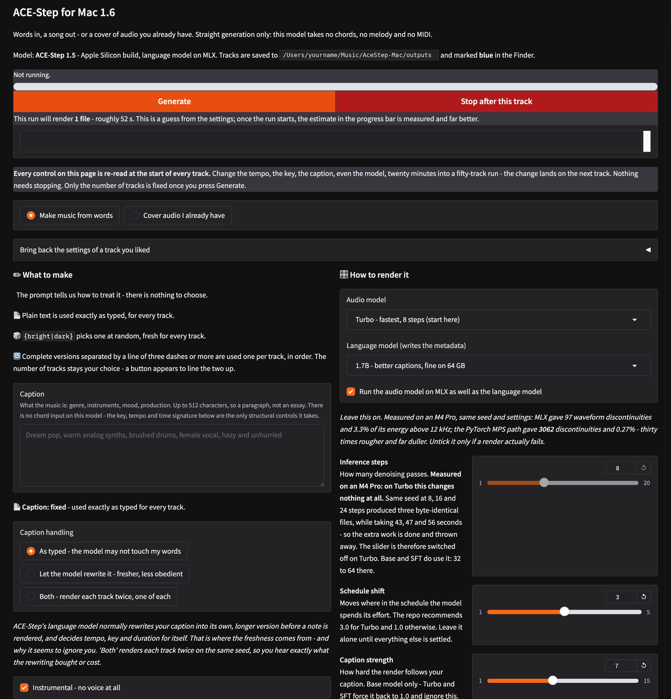

# ACE-Step for Mac — MLX

**A complete front-end for [ACE-Step 1.5](https://github.com/ace-step/ACE-Step-1.5) on Apple Silicon, written for people who make music rather than people who write code.**

Words in, a song out. Everything the model can actually be told — caption,
lyrics, duration, tempo, key, time signature, seed — is on one page, in plain
English, with the trade-off written **beside** each control instead of buried
in a wiki. Nothing leaves your Mac.

[](docs/screenshot-full.png)

*One page. Click for the whole thing.*

> This is an **unofficial** front-end. It is not made by or affiliated with the
> ACE-Step team. It does not include the model.

**[Installation, step by step, assuming no Terminal experience →](INSTALL.md)**
· [Ce README en français →](README.fr.md)

---

## 🆕 New in 1.7

**The XL family.** ACE-Step publishes a second, larger branch - 4B parameters
against 1B - and it is in the Audio model menu, with its cost in the label
because a dropdown should never start a 19 GB download in silence. Measured
here, and this was the open question: **MLX accepts XL.** `[MLX-DiT] Native MLX
DiT decoder initialized successfully`, loaded in 19 seconds, no quantization and
no CPU offload. There is no separate MLX conversion to hunt for - ACE-Step
builds its MLX decoder from the model's own config, so it follows XL to its
larger size on its own.

**The app now reports what MLX actually did**, not what the checkbox asked for.
ACE-Step sets `use_mlx_dit` back to False, non-fatally, when the MLX decoder
will not build - so a render could fall back to PyTorch-MPS without a word while
the `.txt` beside it still claimed MLX. The log says which path ran, and the
sidecar records the truth.

**Two buttons for "where did it go?"** - the outputs folder from the run bar,
and the track you are listening to, selected in the Finder.

**Gradio was quietly eating the disk.** It keeps its own copy of every file it
serves to the browser and never tidies up: three days of batches left **6.8 GB**
behind. `delete_cache` alone does not fix it - it only knows the files that one
process created, so a restart cleared none of it. The app now sweeps the folder
itself at startup, and only ever a folder literally named `gradio`.

**The language-model menu says what each one costs** in gigabytes, so you can
add it to the audio model's size and see whether the sum fits your Mac, instead
of reading a number that was true of the author's.

---

## 🤔 Why this exists

ACE-Step 1.5 is a delight and it is also slightly wild. The first thing anyone
notices is that it is *less obedient* than other music models: you describe
something careful and it hands you something fresher and not quite what you
asked for.

That turns out to be a setting, not a personality. ACE-Step has a small
language model that rewrites your caption before the audio model ever sees it.
Nobody tells you this, and there is no obvious switch.

So the first thing this front-end does is put that switch on the page, with
three positions, including one that renders your track **twice on the same
seed** — once as you typed it, once as the model rewrote it — so you can
actually hear what the rewriting does.

The rest of the app follows the same rule: **if a control does nothing, say
so.** `Steps` is ignored by the Turbo model — verified byte-for-byte, identical
output at 8 steps and at 60 — so the label says *(ignored by Turbo)* rather
than letting you spend an afternoon adjusting it.

---

## 🎛️ What it does

**Make music from words.** A caption, optional lyrics, and the structural
controls the model genuinely accepts: a global key, a tempo (or a tempo range
drawn per track), a time signature, a duration.

**Cover audio you already have**, with a strength dial for how far to travel
from the original.

**Restore a track completely.** Every render writes a `.txt` beside it holding
every setting used. Drop that file back on the page and the whole interface
returns to that state — seed, caption, models, everything. Found something you
like at 30 seconds? Drop, change duration, render it long.

**Batches that stay editable.** Up to 50 tracks, and **every control is re-read
at the start of every track**. Change the tempo, the caption, even the model,
twenty minutes into a fifty-track run, and the change lands on the next track.
Nothing has to be stopped and restarted.

**Dynamic and sequential prompts**, detected automatically, with the mode named
under the box as you type.

🎲 **Dynamic.** One option drawn per render, fresh every time:

```
a {slow|fast} {piano|guitar} piece, {warm|cold}
```

🔁 **Sequential.** Complete versions separated by a line of three or more
dashes, used one per track, in order:

```
first idea
---
second idea
```

**One difference from Draw Things, worth knowing.** There, the number of images
is decided by the number of blocks. Here it is not: the number of tracks stays
a separate setting, because you may well want three renders of each version
rather than one. So a sheet of twenty versions with the tracks slider at
five gives you the first five and nothing else.

To spare you the arithmetic, **a button appears under the box the moment a
sequential prompt is detected** — *Set the number of tracks to 20* — and sets
it for you. Go past the number of versions and it simply starts again from the
top.

The two modes combine: the draw happens after the split, so each block gets its
own.

**Stems**, via [Demucs](https://github.com/adefossez/demucs), optional, in its
own environment so it cannot disturb ACE-Step's pinned PyTorch.

**MP3 and FLAC copies** alongside the WAV, via ffmpeg, also optional.

**A per-track folder** holding the audio, the extra formats, the stems and the
`.txt`. A named batch you can still find three days later.

---

## ⚠️ The three things worth knowing before your first render

**1. In "As typed" mode with everything on Auto, the model gets no metadata at
all.** Tempo and key are only ever computed inside the rewriting path. If you
turn the rewriting off and leave BPM, key and time signature on Auto, the model
is improvising every structural decision — which is exactly what produces the
chaotic results people report. The app shows a warning bar when all three are
on Auto. The fix is to set them yourself.

**2. Writing "instrumental" in the lyrics box does not stop the singing.** The
**Instrumental** checkbox does, by prepending an explicit refusal to the
caption. It is on by default.

**3. The caption is capped at 512 characters.** Past that, the model truncates.

---

## 🍏 Requirements

| | |
|---|---|
| **Mac** | Apple Silicon — M1 or later. Intel Macs cannot run this. |
| **Memory** | 16 GB works (use the 0.6B language model). 24 GB+ is comfortable. |
| **Disk** | ~25 GB, of which 10–16 GB is model weights downloaded on first render. |
| **macOS** | Sonoma (14) or later. |
| **Also needed** | ACE-Step 1.5 itself — [INSTALL.md](INSTALL.md) covers it. |
| **Optional** | ffmpeg (MP3/FLAC), Demucs (stems). |

---

## ⏱️ Measured on an M4 Pro (64 GB)

Real numbers from real runs, not estimates. Your Mac will differ, but the
shape holds: **every render pays a fixed cost before a single second of audio
exists**, so short tracks are not proportionally cheaper.

| What | Setting | Result |
|---|---|---|
| One 120 s track | Turbo, 8 steps, batch 1 | about 50 s |
| 80 files | Turbo, 30 s each, batch 4 | about 40 min |
| Same seed at 8 / 16 / 24 steps | Turbo | **byte-identical files**, 43 / 47 / 56 s |
| MLX vs PyTorch-MPS | same seed and settings | 97 waveform discontinuities vs **3062** |

That third row is why the Steps slider is switched off on Turbo: the extra
passes are computed and thrown away. The fourth is why MLX is the default.


---

## 🎚️ The controls, in order

### Caption

The description of the piece — not the lyrics. 512 characters maximum.

**Caption handling** sits just below it:

- **As typed** — your words go to the model untouched.
- **Rewritten** — the language model expands them first, adding tempo, key and
  time signature of its own.
- **Both** — two renders on the same seed, one of each. This is how you compare.

### Lyrics

**Instrumental — no voice at all** is ticked by default. Untick it and the
lyrics box opens, with a language selector.

### Duration, tempo, key, time signature

Duration in seconds; 0 lets the model decide. Tempo has two boxes — a value,
and an upper bound if you want a range drawn per track; leave the second at 0
for a fixed tempo. See warning 1 above about leaving key and time signature on
Auto.

### Models

**Audio model.** *Turbo* is the fast one and the place to start. *SFT* finishes
better and takes four to eight times longer. *Base* is the only one that
accepts a CFG scale.

**Language model.** *1.7B* is the good default. *0.6B* if you are tight on
memory. *4B* is known to exhaust memory on macOS.

**Run the audio model on MLX as well** — leave this ticked. It is the clean
path: measured on the same seed, MLX produced 97 waveform discontinuities where
PyTorch-MPS produced 3062. Untick it only if a render fails strangely.

### Seed

`-1` is random. A fixed seed replays the same piece. **Add 1 to the seed for
each extra track** explores around an idea that works — same family, real
variation.

### Batches

**Number of tracks**, up to 100. **Batch size** renders several at once, sharing
the expensive part. **Batch name** names the folder — get into the habit, an
unnamed run is one you cannot find later.

---

## 🔧 Design notes

A few decisions that are deliberate, in case they look like oversights:

- **It imports ACE-Step's own handlers** and calls its own `generate_music`
  rather than reimplementing anything, so it stays correct when that project
  moves. That is why it must run inside ACE-Step's virtual environment.
- **It filters the settings it sends.** If ACE-Step renames a field, you lose
  that one setting and the log tells you which, instead of the app crashing.
- **Demucs is deliberately in a separate environment.** It needs a different
  PyTorch. Installing it alongside would break ACE-Step.
- **Nothing is uploaded, ever.** There is no telemetry, no account, no network
  call except the one that downloads the model weights.

---

## 📜 Licences and attribution

**This front-end** is MIT — see [LICENSE](LICENSE). Do what you like with it.

**ACE-Step 1.5 is not included here** and is not covered by that licence. It is
downloaded separately by you, from its own project, under its own terms. At the
time of writing that project ships an **MIT** licence, which unlike several
other music models places no non-commercial restriction on you — but licences
change, so check
[theirs](https://github.com/ace-step/ACE-Step-1.5/blob/main/LICENSE) rather
than taking my word for it, especially before selling anything you make.

**The model weights** are downloaded from the ACE-Step project on first render
and stay on your machine.

**Demucs**, used for the optional stem separation, is a separate project with
its own licence: [adefossez/demucs](https://github.com/adefossez/demucs).

Nothing in this repository is generated audio, and no audio you make with it
passes through me or anyone else.

---

## 👋 Who made this

Jean-Pascal — **[Quick-Eyed Sky](https://www.youtube.com/@QuickEyedSky)** on
YouTube, [QES](https://huggingface.co/QES) on Hugging Face. Not a programmer:
this exists because the controls were not explained anywhere and I wanted to
understand them.

If it saved you an afternoon, you can
[buy me a coffee](https://buymeacoffee.com/oFJ5CiY7n). Entirely optional, and
the project stays exactly as free either way.

---

## 🙏 Thanks

To the [ACE-Step team](https://github.com/ace-step/ACE-Step-1.5) for the model
and for supporting Apple Silicon properly, and to
[Demucs](https://github.com/adefossez/demucs) for the stem separation.
